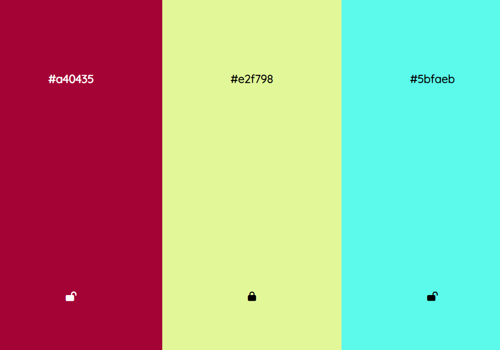

# Color changer page for choosing the suitable color palette

- 5 rectangles with the lock mechanism and names
- hit the space button to switch their colors
- by clicking on the name of the color you copy it
- by locking the right one and going left you can collect the best matching colors
